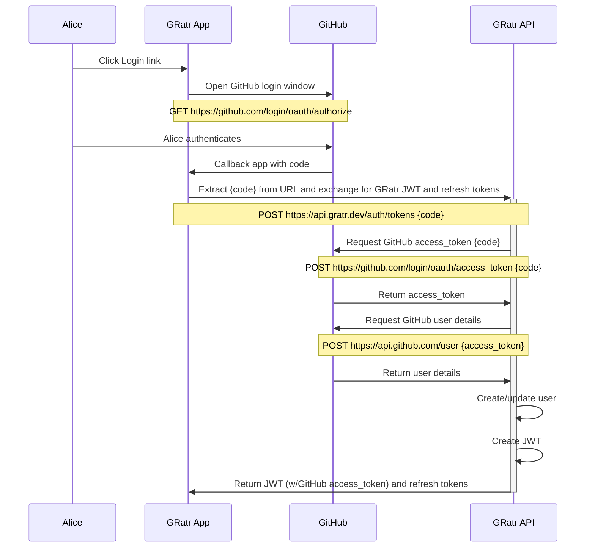

# Developer Guide <!-- omit in toc -->

_A constantly evolving guide to developing GRatr. It captures the current state of the architecture, includes rationales and guiding principals._

## Table of Contents <!-- omit in toc -->

- [About](#about)
  - [Approach](#approach)
- [Authy Stuff](#authy-stuff)
  - [Authentication with GitHub oAuth2 Authorisation Code Grant](#authentication-with-github-oauth2-authorisation-code-grant)
  - [Refresh Token Flow](#refresh-token-flow)
- [API Stuff](#api-stuff)
- [Database Stuff](#database-stuff)
- [Web Client](#web-client)
  - [Templates](#templates)

## About

Instead of capturing the technical architecture to an ADO wiki page as I have done in the past I am trying something new by keeping all documentation closer to the code. This should be faster/easier to update since I have VSCode open all the time. Which in turn, should mean that I am more likely to capture valuable nuances which would otherwise be lost because I didn't want to waste the time context switching.

Please note that this project is implemented across three repositories, one each for the web client, API and the browser extension. However, to maintain a holistic "developer" view of the architecture there will just this one Developer Guide, maintained in the API repo. The other two repos will point to here.

### Approach

- Lean tooling
- Lean coding
- Lean libraries
- No client-side JavaScript framework

Pros:

- Less time spent f**king around with giant convoluted toolsets and massive libraries created to [battle poor social network architecture](https://blog.risingstack.com/the-history-of-react-js-on-a-timeline/#:~:text=Back%20in%202011,of%20React.js.)
- Quicker time to market
- Faster page loads
- Lower page weights
- 100% Lighthouse scores for performance, a11y, seo and best practices
- Exceptionally low running costs
- Easier debugging
- Greater enjoyment of the process
- More time to focus on the fun aspect of creative problem solving

## Authy Stuff

- Exchange GitHub userId for JWT
- Verify GitHub userId when exchanging
- Return JWT and refresh tokens
- Compare state value in and out for security
- I considered Azure [Active Directory B2C](https://docs.microsoft.com/en-us/azure/active-directory-b2c/overview) which is Azure's answer to [AWS Cognito](https://aws.amazon.com/cognito/) and while it looks compelling, and the docs and code samples are awesome, it is more than I need.

### Authentication with GitHub oAuth2 Authorisation Code Grant



### Refresh Token Flow

Pending...

## API Stuff

While there are many API types I find that most web applications work well with one or more of the following:

- **REST**: Perfect for transactional interfaces requiring CRUD operations on distinct resources.
- **GraphQL**: The ability to infinitely shape the data from a GraphQL API makes it perfect for marrying data from a content management application (CMA) with templates to generate output served by the content delivery application (CDA).
- **Asynchronous**: Asynchronous APIs using WebSockets and SSE are perfect for low-latency situations with continuous flows of data such as chat apps.

GRatr currently implements just a REST API which is defined and documented using the [Open API Specification 3.1.0](https://www.openapis.org/) (OAS) and can be found in [docs/rest-api](rest-api/openapi.yaml).

The API repository has a dev dependency on [Redocly's](https://redoc.ly/) [OpenAPI CLI toolset](https://github.com/Redocly/openapi-cli). This CLI tool makes it easy to split long OAS yaml defintion files into smaller and far more manageable components. These individual files can be later bundled back into a single JSON file for consumption by our in-API validator, [Z-Schema](https://github.com/zaggino/z-schema). They can also be linted to catch errors early.

Package.json contains an NPM script that will simultaneously lint and bundle the latest changes into `src/rest.json`.

```shell
npm run bundleSchemas
```

A second package.json script will open the Redocly reader locally with `docs/rest-api/openapi.yaml` loaded.

```shell
npm run showDocs
```

_Note: While there are several VSCode extensions offering OAS validation and inline previewing, most do not support OAS 3.1.0 (yet). For this reason I have evolved my workflow so that I edit in VSCode and lint/preview from the command-line._

## Database Stuff

My key/val experience so far has been with [Amazon DynamoDB](https://aws.amazon.com/dynamodb/) but GRatr will be built with [Azure Cosmos DB using the table API](https://docs.microsoft.com/en-us/azure/cosmos-db/choose-api#table-api) which is functionally similar. The schemaless [schema](https://docs.google.com/spreadsheets/d/1dL2uTcKjE7icbfQq-ESl6cwSHZmy9VeSHuGHF_NsV3M/edit?usp=sharing) is currently written with DynamoDB language but will be evolved into Cosmos speak as I learn more.

## Web Client

I have decided to opt-out of the SPA-like trend and stick with a conventional multi-page web application. SPAs require custom routers and subsequent management of the browser history through push state. Yet the browser already provides the best possible router - the address bar and back button!

All pages, including each repository results page, will be statically generated and served from a plain old HTTP2 server. This will significantly reduce reliance on complex database caching for busy repos and should result in sub-one-second render times from pretty much anywhere in the world.

The web client will rely on a simple API (this repo) and a few `fetch()`
calls to populate search results, and save user ratings and reviews.

The API will also serve JSON data to planned browser extension that will inject GRatr ratings into GitHub and NPM pages.

While JavaScript will be required for handling GitHub authentication and fetching search results, elsewhere its role will be for progressive enhancement. This, in concert with a lean-dependency and no-framework approach will require a very small JS footprint. As such, the small single `main.js` file will be present on each page. There will be no need for page-specific JavaScript files since performance will be optimised when the tiny main.js is cached on the first page request.

General purpose libraries like jQuery, lodash, etc will always be avoided. There is nothing they do that cannot be accomplished with Vanilla JS. In fact, third party libraries should only ever be used when they provide significant domain-specific capabilities.

The only two client-side libraries currently used are:

- [marked](https://github.com/markedjs/marked): Allows the application to (de)serialise markdown to/from JSON so that it can safely traverse the API calls.
  
  I have considered writing a super-lightweight parser, essentially a glorified regex, to support just bold, italic and bullets. However, this still requires a lot of edge-case testing and limits the user in what they can enter for a comment. Marked is a zero-dependency library that has been battle-tested.  

  _Note: Considering <https://www.npmjs.com/package/markdown-wasm> which is slightly smaller than marked and implemented in WASM._

### Templates

- Home
  - /
- Legal (about, privacy, terms of service)
  - /about
  - /privacy
  - /terms-of-service
- Search results
  - /results
- Project
  - /{organisation}/{repository} (statically generated)
  - /organisation/repository (new repo template)
