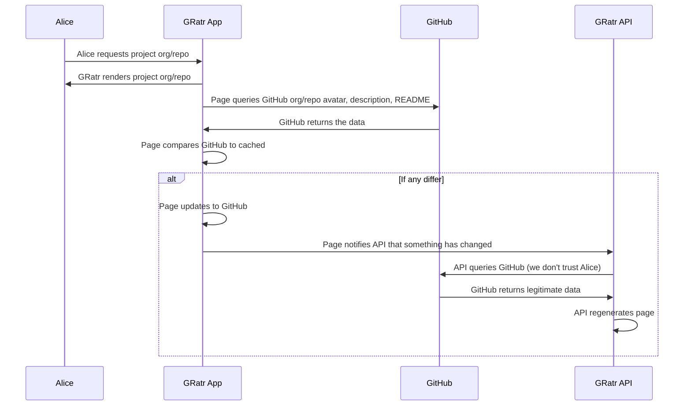

# Developer Guide <!-- omit in toc -->

_A constantly evolving guide to developing GRatr. It captures the current state of the architecture, includes rationales and guiding principals._

## Table of Contents <!-- omit in toc -->

- [About](#about)
  - [Approach](#approach)
  - [Mermaid Diagrams](#mermaid-diagrams)
- [Taxonomy](#taxonomy)
- [Rendering Strategy for Performance and Efficiency](#rendering-strategy-for-performance-and-efficiency)
- [Authy Stuff](#authy-stuff)
  - [Authentication with GitHub oAuth2 Authorisation Code Grant](#authentication-with-github-oauth2-authorisation-code-grant)
  - [Refresh Token Flow](#refresh-token-flow)
- [API Stuff](#api-stuff)
- [Database Stuff](#database-stuff)
- [Web Client](#web-client)
  - [Including Potentially Changing GitHub Content](#including-potentially-changing-github-content)
  - [Templates](#templates)
    - [Index](#index)
    - [Legal](#legal)
    - [Search results](#search-results)
    - [Project](#project)
- [Browser Extension](#browser-extension)

## About

Instead of capturing the technical architecture to an ADO wiki page as I have done in the past I am trying something new by keeping all documentation closer to the code. This should be faster/easier to update since I have VSCode open all the time. Which in turn, should mean that I am more likely to capture valuable nuances which would otherwise be lost because I didn't want to waste the time context switching.

Please note that this project is implemented across three repositories, one each for the web client, API and the browser extension. However, to maintain a holistic "developer" view of the architecture there will just this one Developer Guide, maintained in the API repo. The other two repos will point to here.

### Approach

- Lean tooling
- Lean coding
- Lean libraries
- No client-side JavaScript framework

Pros:

- Less time spent f**king around with giant convoluted toolsets and massive libraries created to [battle poor social network architecture](https://blog.risingstack.com/the-history-of-react-js-on-a-timeline/#:~:text=Back%20in%202011,of%20React.js.)
- Quicker time to market
- Faster page loads
- Lower page weights
- 100% Lighthouse scores for performance, a11y, seo and best practices
- Exceptionally low running costs
- Easier debugging
- Greater enjoyment of the process
- More time to focus on the fun aspect of creative problem solving

### Mermaid Diagrams

This developer guide takes advantage of [Mermaid](https://mermaid-js.github.io/mermaid/#/) for rendering sequence diagrams. Unfortunatley GitHub does not yet support Mermaid itself. If you are reading this file on GitHub you may want to consider installing this [extension](
https://chrome.google.com/webstore/detail/github-%2B-mermaid/goiiopgdnkogdbjmncgedmgpoajilohe/related?hl=en). There is also a long-running [feature request](https://github.community/t/feature-request-support-mermaid-markdown-graph-diagrams-in-md-files/1922) to add Mermaid support to GitHub. As of this writing it has 548 likes and more than 250 comments. Please consider adding your support to it.

VSCode users, there is a [Markdown Preview Mermaid Support](https://marketplace.visualstudio.com/items?itemName=bierner.markdown-mermaid) extension available that will automatically render Mermaid diagrams in preview mode.

## Taxonomy

- **project**: A project refers to a GitHub repository and is shorthhand for the unique organisation/repository path. GitHub projects can be mapped onto GRatr projects by simply changing the domain part of the URL. E.g. The project found at <https://github.com/tforster/joy> can also be found in GRatr at <https://gratr.dev/tforster/joy>.
  
## Rendering Strategy for Performance and Efficiency

One of the goals of GRatr is use static pages to present individual organisation/repository results.

- Static pages will be incredibly fast to load
- The read/write ratio is heavily skewed towards reading and caching with a CDN is far more efficient than caching with a database

However, this presents some interesting challenges since GitHub has ~200,000,000 repositories.

It does not make sense to crawl every GitHub repository and create a matching  GRatr ratings page because:

- Requires significant resources making it cost prohibitive
- Requires building and deploying a crawler that constantly checks for new repositories
- ALL GRatr pages will be empty on launch day
- Most will remain empty until GRatr gets significant traction
- Even when GRatr is wildly successful there will still be many repositories that will never be rated, leaving them empty on GRatr
  
The best strategy is one that leverages on-demand creation (and updating) of the static pages. When GRatr launches it will effectively have no results pages (some final test pages notwithstanding). Pages will be created to Azure blob storage using a serverless function when a user saves the first ratings for a specific project. The same serverless function will replace the static page with a new one after each subsequent user adds their own ratings.

I do anticipate that a tiny subset of the 200,000,000 repositories might be so popular that the same page is regenerated frequently. If this becomes a performance or cost issue (e.g. too many CDN invalidations) then the approach will be to queue changes into batches. This means that user submitted ratings become eventually consistent but the volume of pre-existing ratings should keep minimise the standard deviation.

```mermaid
sequenceDiagram
  participant A as Alice
  participant G as GRatr
  participant H as GitHub

  A->>G: Enters criteria into search page
  G->>H: Queries GitHub
  H->>G: Returns a matching repository path org/rep
  G->>G: Redirects to gratr/org/rep static page

  alt gratr/o/r does not exist
    G->>G: 404 handler shows new project page
  end

  A->>G: Alice rates the project
  G->>G: Serverless function (re)generates static page
  ```

## Authy Stuff

- Exchange GitHub userId for JWT
- Verify GitHub userId when exchanging
- Return JWT and refresh tokens
- Compare state value in and out for security
- I considered Azure [Active Directory B2C](https://docs.microsoft.com/en-us/azure/active-directory-b2c/overview) which is Azure's answer to [AWS Cognito](https://aws.amazon.com/cognito/) and while it looks compelling, and the docs and code samples are awesome, it is more than I need.

### Authentication with GitHub oAuth2 Authorisation Code Grant

```mermaid
sequenceDiagram
  
  Participant A as Alice
  Participant W as GRatr App
  Participant G as GitHub
  Participant I as GRatr API
  
  A->>W: Click Login link
  W->>G: Open GitHub login window
  Note over W, G: GET https://github.com/login/oauth/authorize
  
  A->>G: Alice authenticates   
  G->>W: Callback app with code
  
  W->>+I: Extract {code} from URL and exchange for GRatr JWT and refresh tokens
  Note over W, I: POST https://api.gratr.dev/auth/tokens {code}
  
  I->>G: Request GitHub access_token {code} 
  Note over I, G: POST https://github.com/login/oauth/access_token {code}
  G->>I: Return access_token
  
  I->>G: Request GitHub user details
  Note over I, G: POST https://api.github.com/user {access_token}
  G->>I: Return user details

  I->>I: Create/update user
  I->>I: Create JWT
  I->>-W: Return JWT (w/GitHub access_token) and refresh tokens  
```

### Refresh Token Flow

Pending...

## API Stuff

While there are many API types I find that most web applications work well with one or more of the following:

- **REST**: Perfect for transactional interfaces requiring CRUD operations on distinct resources.
- **GraphQL**: The ability to infinitely shape the data from a GraphQL API makes it perfect for marrying data from a content management application (CMA) with templates to generate output served by the content delivery application (CDA).
- **Asynchronous**: Asynchronous APIs using WebSockets and SSE are perfect for low-latency situations with continuous flows of data such as chat apps.

GRatr currently implements just a REST API which is defined and documented using the [Open API Specification 3.1.0](https://www.openapis.org/) (OAS) and can be found in [docs/rest-api](rest-api/openapi.yaml).

The API repository has a dev dependency on [Redocly's](https://redoc.ly/) [OpenAPI CLI toolset](https://github.com/Redocly/openapi-cli). This CLI tool makes it easy to split long OAS yaml defintion files into smaller and far more manageable components. These individual files can be later bundled back into a single JSON file for consumption by our in-API validator, [Z-Schema](https://github.com/zaggino/z-schema). They can also be linted to catch errors early.

Package.json contains an NPM script that will simultaneously lint and bundle the latest changes into `src/rest.json`.

```shell
npm run bundleSchemas
```

A second package.json script will open the Redocly reader locally with `docs/rest-api/openapi.yaml` loaded.

```shell
npm run showDocs
```

_Note: While there are several VSCode extensions offering OAS validation and inline previewing, most do not support OAS 3.1.0 (yet). For this reason I have evolved my workflow so that I edit in VSCode and lint/preview from the command-line._

## Database Stuff

My key/val experience so far has been with [Amazon DynamoDB](https://aws.amazon.com/dynamodb/) but GRatr will be built with [Azure Cosmos DB using the table API](https://docs.microsoft.com/en-us/azure/cosmos-db/choose-api#table-api) which is functionally similar. The schemaless [schema](https://docs.google.com/spreadsheets/d/1dL2uTcKjE7icbfQq-ESl6cwSHZmy9VeSHuGHF_NsV3M/edit?usp=sharing) is currently written with DynamoDB language but will be evolved into Cosmos speak as I learn more.

## Web Client

I have decided to opt-out of the SPA-like trend and stick with a conventional multi-page web application. SPAs require custom routers and subsequent management of the browser history through push state. Yet the browser already provides the best possible router - the address bar and back button!

All pages, including each repository results page, will be statically generated and served from a plain old HTTP2 server. This will significantly reduce reliance on complex database caching for busy repos and should result in sub-one-second render times from pretty much anywhere in the world.

The web client will rely on a simple API (this repo) and a few `fetch()`
calls to populate search results, and save user ratings and reviews.

The API will also serve JSON data to planned browser extension that will inject GRatr ratings into GitHub and NPM pages.

While JavaScript will be required for handling GitHub authentication and fetching search results, elsewhere its role will be for progressive enhancement. This, in concert with a lean-dependency and no-framework approach will require a very small JS footprint. As such, the small single `main.js` file will be present on each page. There will be no need for page-specific JavaScript files since performance will be optimised when the tiny main.js is cached on the first page request.

General purpose libraries like jQuery, lodash, etc will always be avoided. There is nothing they do that cannot be accomplished with Vanilla JS. In fact, third party libraries should only ever be used when they provide significant domain-specific capabilities.

The only two client-side libraries currently used are:

- [marked](https://github.com/markedjs/marked): Allows the application to (de)serialise markdown to/from JSON so that it can safely traverse the API calls.
  
  I have considered writing a super-lightweight parser, essentially a glorified regex, to support just bold, italic and bullets. However, this still requires a lot of edge-case testing and limits the user in what they can enter for a comment. Marked is a zero-dependency library that has been battle-tested.  

  _Note: Considering <https://www.npmjs.com/package/markdown-wasm> which is slightly smaller than marked and implemented in WASM._

### Including Potentially Changing GitHub Content

GRatr is not intended to be a GitHub alternative but it does need to show some of the repository information in its own UI. Information including:

- Organisation name
- Repository name
- Avatar
- Description
- README (if one exists)

Saving this information in the GRatr database and/or static page will yield fast performance. However, this approach must be combined with a strategy that checks for changes at source so that GRatr can be updated.

Since GitHub allows its API to be queried anonymously for public repositories the GRatr project page will implement the following sequence flow.



This flow has numerous advantages:

- GRatr continues to leverage highly performant static pages for all project results  
- The user sees content immediately
- Content that is newer on GitHub is progressively revealed in the UI, typically within a few hundred milliseconds
- GRatr leverages the users network to check for changes saving a significant number of outbound HTTP requests over time
  
The implementation of this flow does not require any GRatr user identity since it will only retrieve GitHub specific information. When it regenerates the static page it does not alter any of the existing ratings or reviews. As such it will be implemented as a simple PUT on the `/{organisation}/{repository}` endpoint.

_Note: To prevent abuse where a malicious actor could simply script infinite PUT requests a TTL will be added to the database schema. Any PUT request received within the TTL will be ignored._

### Templates

The web client uses [WebProducer](https://github.com/tforster/webproducer) to generate static pages from data and [Handlebars](https://handlebarsjs.com/) templates. Handlebars has been around for a long time but it is still one of the leanest and fastest templating engines available. Unlike JSX Handlebars uses HTML making it much easier to visualise the page in the minds DOM.

The following four templates will suffice to implement all GRatr content:

#### Index

- Implements the home/landing/marketing page with embedded leaderboard.
- Rendered at build-time
  - /

#### Legal

- Simple template consisting of one column, a title and a body.
- Used to render mostly-text pages
- Rendered at build-time
  - /about
  - /privacy
  - /terms-of-service

#### Search results

- Implements the search results listing
- Rendered at build-time with results fetched on demand and injected using HTML &lt;template&gt; element.
  - /results
  
#### Project

- Implements the new repo page
  - Rendered at build-time
  -
  - /organisation/repository
- Implements individual project pages
  - (re)Rendered in a serverless function
  - /{organisation}/{repository} e.g. `/tforster/joy`, `google/log4jscanner`, etc.

## Browser Extension

A browser extension is planned that will target [GitHub](https://github.com) and [NPM search pages](https://www.npmjs.com/) (with appropriate permission granted by the browser owner of course). It will inject the aggregate results for currently displayed repo as a small UI element. This will make it easier for developers to see GRatr scores without having to open up www.gratr.dev directly. The UI element will be clickable to take the developer directly to the GRatr page if they want to see more detail, or add their own ratings.
