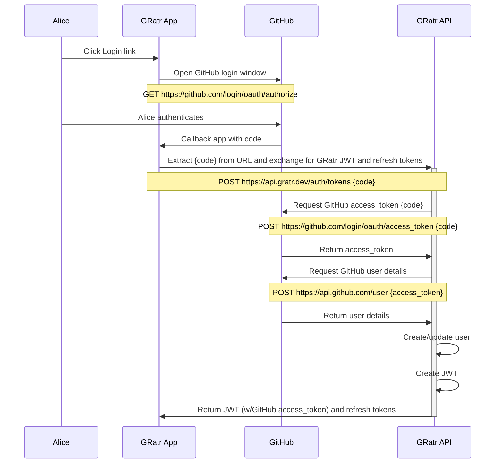

# Developer Guide <!-- omit in toc -->

_A constantly evolving guide to developing api.gratr.dev. It captures the current state of the architecture, includes rationales and guiding principals._

## Table of Contents <!-- omit in toc -->

- [About](#about)
- [Authy Stuff](#authy-stuff)
  - [Authentication with GitHub oAuth2 Authorisation Code Grant](#authentication-with-github-oauth2-authorisation-code-grant)
  - [Refresh Token Flow](#refresh-token-flow)
- [Database Stuff](#database-stuff)
- [Web Client](#web-client)
  - [Templates](#templates)

## About

Instead of capturing the technical architecture to an ADO wiki page as I have done in the past I am trying something new by keeping all documentation closer to the code. This should be faster/easier to update since I have VSCode open all the time. Which in turn, should mean that I am more likely to capture valuable nuances which would otherwise be lost because I didn't want to waste the time context switching

Please note that this project is implemented across three repositories, one each for the web client, API and the browser extension. However, to maintain a holistic "developer" view of the architecture there will just this one Developer Guide, maintained in the API repo. The other two repos will point to here.

## Authy Stuff

- Exchange GitHub userId for JWT
- Verify GitHub userId when exchanging
- Return JWT and refresh tokens
- I considered Azure [Active Directory B2C](https://docs.microsoft.com/en-us/azure/active-directory-b2c/overview) which is Azure's answer to [AWS Cognito](https://aws.amazon.com/cognito/) and while it looks compelling, and the docs and code samples are awesome, it is more than I need.

### Authentication with GitHub oAuth2 Authorisation Code Grant

### Refresh Token Flow

Pending...

## Database Stuff

My key/val experience so far has been with [Amazon DynamoDB](https://aws.amazon.com/dynamodb/) but GRatr will be built with [Azure Cosmos DB using the table API](https://docs.microsoft.com/en-us/azure/cosmos-db/choose-api#table-api) which is functionally similar. The schemaless [schema](https://docs.google.com/spreadsheets/d/1dL2uTcKjE7icbfQq-ESl6cwSHZmy9VeSHuGHF_NsV3M/edit?usp=sharing) is currently written with DynamoDB language but will be evolved into Cosmos speak as I learn more.

## Web Client

I have decided to opt-out of the SPA-like trend and stick with a conventional multi-page web application. SPAs require custom routers and subsequent management of the browser history through push state. Yet the browser already provides the best possible router - the address bar and back button!

All pages, including each repository results page, will be statically generated and served from a plain old HTTP2 server. This will significantly reduce reliance on complex database caching for busy repos and should result in sub-one-second render times from pretty much anywhere in the world.

The web client will rely on a simple API (this repo) and a few `fetch()`
calls to populate search results, and save user ratings and reviews.

The API will also serve JSON data to planned browser extension that will inject GRatr ratings into GitHub and NPM pages.

While JavaScript will be required for handling GitHub authentication and fetching search results, elsewhere its role will be for progressive enhancement. This, in concert with a no-dependency and no-framework approach will require a very small JS footprint. As such, the small single `main.js` file will be present on each page. There will be no need for page-specific JavaScript files since performance will be optimised when the tiny main.js is cached on the first page request.

### Templates

- Home
  - /
- Legal (about, privacy, terms of service)
  - /about
  - /privacy
  - /terms-of-service
- Search results
  - /results
- Project
  - /{organisation}/{repository} (statically generated)
  - /organisation/repository (new repo template)
